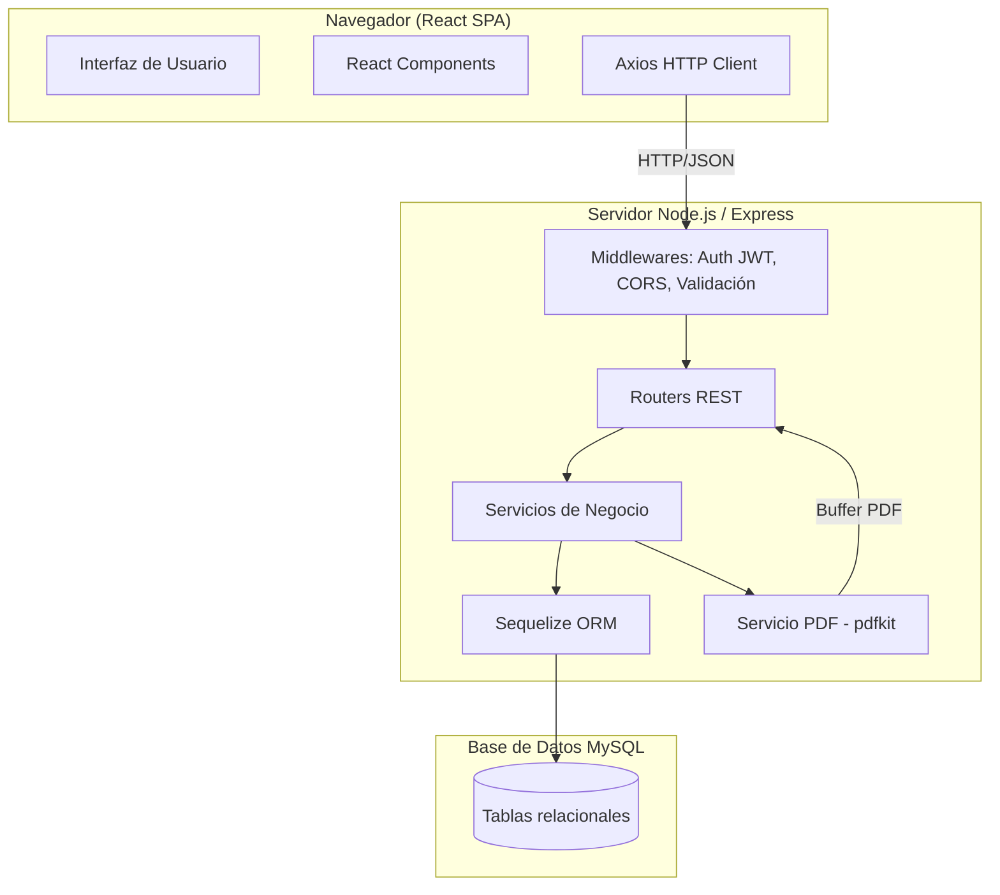
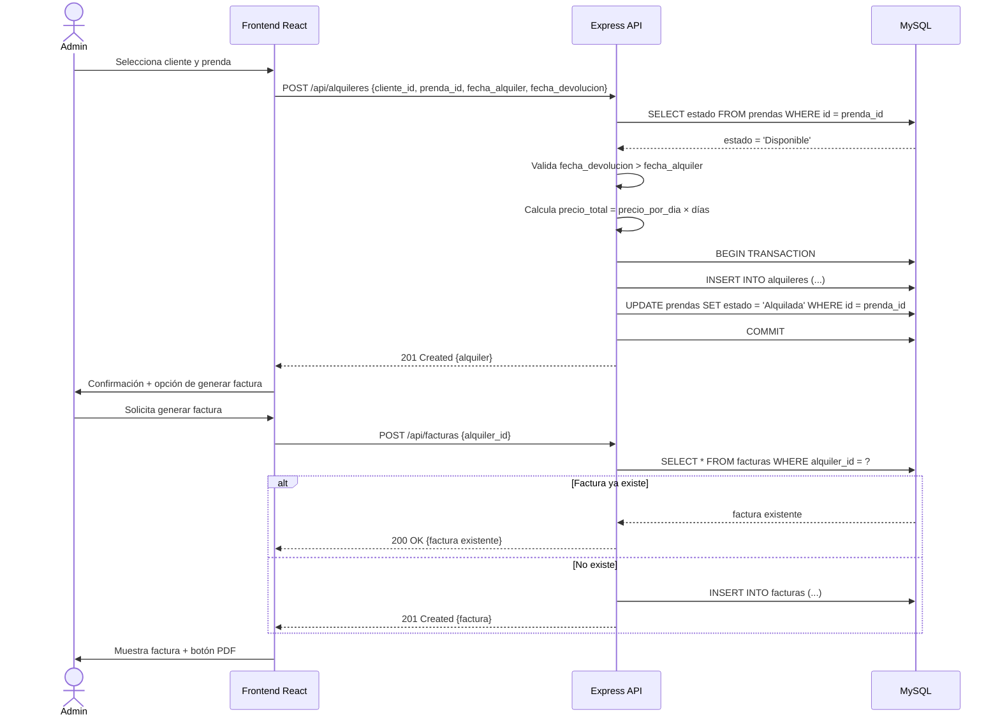

# Documento de Diseño Técnico
## Sistema de Gestión de Alquiler de Prendas

---

## Descripción General

El sistema es una aplicación web de tipo cliente-servidor que digitaliza la operación de un negocio de alquiler de prendas para eventos. Permite gestionar el inventario, los clientes, los alquileres, la facturación y los reportes desde una interfaz web centralizada.

El sistema sigue una arquitectura REST API desacoplada: el frontend en React consume una API HTTP construida con Node.js/Express, que a su vez persiste los datos en MySQL. La generación de PDFs se realiza en el servidor usando pdfkit.

---

## Arquitectura

### Stack Tecnológico

| Capa | Tecnología | Justificación |
|------|-----------|---------------|
| Frontend | React + Vite | Componentes reutilizables, ecosistema maduro, SPA sin recarga de página |
| Backend | Node.js + Express | Mismo lenguaje en todo el stack, amplio ecosistema, rendimiento adecuado para carga esperada |
| Base de datos | MySQL | Datos relacionales con integridad referencial, soporte robusto para transacciones |
| Autenticación | JWT + bcrypt | Stateless, fácil de escalar; bcrypt para hash seguro de contraseñas |
| Generación PDF | pdfkit | Librería Node.js nativa, sin dependencias de navegador headless |
| ORM | Sequelize | Migraciones, validaciones y abstracción de queries para MySQL |

### Diagrama de Arquitectura



### Flujo de Solicitud HTTP

```
Cliente → [JWT Middleware] → [Validación] → Router → Servicio → Repositorio (Sequelize) → MySQL
                                                              ↓
                                                       Respuesta JSON
```

---

## Componentes e Interfaces

### Módulos del Backend

| Módulo | Responsabilidad | Rutas base |
|--------|----------------|------------|
| AuthModule | Login, logout, validación JWT, bloqueo por intentos | `/api/auth` |
| InventarioModule | CRUD de prendas, cambio de estado, filtros | `/api/prendas` |
| ClientesModule | CRUD de clientes, búsqueda, historial | `/api/clientes` |
| AlquileresModule | Registro, devolución, consultas, vencimientos | `/api/alquileres` |
| FacturasModule | Generación, búsqueda, exportación PDF | `/api/facturas` |
| ReportesModule | Ingresos, ocupación, prendas populares, vencidos | `/api/reportes` |

### API REST — Endpoints Principales

```
# Autenticación
POST   /api/auth/login
POST   /api/auth/logout

# Prendas
GET    /api/prendas              # listar con filtros opcionales (?estado=&tipo=&talla=&color=)
POST   /api/prendas              # crear
PUT    /api/prendas/:id          # editar
DELETE /api/prendas/:id          # eliminar
PATCH  /api/prendas/:id/estado   # cambiar estado (Disponible / En_Mantenimiento)

# Clientes
GET    /api/clientes             # listar / buscar (?q=nombre_o_cedula)
POST   /api/clientes             # crear
PUT    /api/clientes/:id         # editar
DELETE /api/clientes/:id         # eliminar
GET    /api/clientes/:id/historial

# Alquileres
GET    /api/alquileres           # listar (?estado=&desde=&hasta=)
POST   /api/alquileres           # registrar nuevo alquiler
PATCH  /api/alquileres/:id/devolucion  # registrar devolución

# Facturas
GET    /api/facturas             # listar / buscar (?q=numero_o_cliente)
POST   /api/facturas             # generar factura para un alquiler
GET    /api/facturas/:id/pdf     # exportar PDF

# Reportes
GET    /api/reportes/ingresos    # ?desde=&hasta=
GET    /api/reportes/prendas-populares
GET    /api/reportes/vencidos
GET    /api/reportes/ocupacion
GET    /api/reportes/:tipo/pdf   # exportar reporte en PDF
```

### Módulos del Frontend (React)

| Componente / Página | Descripción |
|--------------------|-------------|
| `LoginPage` | Formulario de autenticación |
| `DashboardPage` | Resumen: conteo por estado, alquileres próximos a vencer |
| `InventarioPage` | Tabla de prendas con filtros, acciones CRUD |
| `PrendaFormModal` | Modal para crear/editar prenda |
| `ClientesPage` | Tabla de clientes con búsqueda |
| `ClienteFormModal` | Modal para crear/editar cliente |
| `ClienteHistorialModal` | Historial de alquileres del cliente |
| `AlquileresPage` | Lista de alquileres activos/vencidos |
| `NuevoAlquilerModal` | Formulario de registro de alquiler |
| `FacturasPage` | Historial de facturas con búsqueda |
| `ReportesPage` | Selector de reporte + visualización + exportar PDF |

---

## Modelos de Datos

### Diagrama Entidad-Relación

```mermaid
erDiagram
    USUARIOS {
        int id PK
        varchar nombre
        varchar email
        varchar password_hash
        datetime created_at
    }

    PRENDAS {
        int id PK
        varchar tipo
        varchar talla
        varchar color
        decimal precio_por_dia
        enum estado
        varchar foto_url
        datetime created_at
        datetime updated_at
    }

    CLIENTES {
        int id PK
        varchar nombre_completo
        varchar cedula UK
        varchar telefono
        varchar direccion
        varchar email
        datetime created_at
    }

    ALQUILERES {
        int id PK
        int cliente_id FK
        int prenda_id FK
        date fecha_alquiler
        date fecha_devolucion
        decimal precio_total
        enum estado
        datetime created_at
        datetime updated_at
    }

    FACTURAS {
        int id PK
        int alquiler_id FK UK
        int numero_factura UK
        date fecha_emision
        datetime created_at
    }

    INTENTOS_LOGIN {
        int id PK
        varchar email
        int intentos_fallidos
        datetime bloqueado_hasta
        datetime updated_at
    }

    CLIENTES ||--o{ ALQUILERES : "realiza"
    PRENDAS ||--o{ ALQUILERES : "incluida en"
    ALQUILERES ||--o| FACTURAS : "tiene"
```

### Definición de Tablas

#### `prendas`
| Campo | Tipo | Restricciones |
|-------|------|--------------|
| id | INT | PK, AUTO_INCREMENT |
| tipo | VARCHAR(100) | NOT NULL |
| talla | VARCHAR(20) | NOT NULL |
| color | VARCHAR(50) | NOT NULL |
| precio_por_dia | DECIMAL(10,2) | NOT NULL, CHECK > 0 |
| estado | ENUM('Disponible','Alquilada','En_Mantenimiento') | NOT NULL, DEFAULT 'Disponible' |
| foto_url | VARCHAR(500) | NULL |
| created_at | DATETIME | NOT NULL |
| updated_at | DATETIME | NOT NULL |

#### `clientes`
| Campo | Tipo | Restricciones |
|-------|------|--------------|
| id | INT | PK, AUTO_INCREMENT |
| nombre_completo | VARCHAR(200) | NOT NULL |
| cedula | VARCHAR(20) | NOT NULL, UNIQUE |
| telefono | VARCHAR(20) | NOT NULL |
| direccion | VARCHAR(300) | NOT NULL |
| email | VARCHAR(150) | NOT NULL |
| created_at | DATETIME | NOT NULL |

#### `alquileres`
| Campo | Tipo | Restricciones |
|-------|------|--------------|
| id | INT | PK, AUTO_INCREMENT |
| cliente_id | INT | FK → clientes.id, NOT NULL |
| prenda_id | INT | FK → prendas.id, NOT NULL |
| fecha_alquiler | DATE | NOT NULL |
| fecha_devolucion | DATE | NOT NULL, CHECK > fecha_alquiler |
| precio_total | DECIMAL(10,2) | NOT NULL |
| estado | ENUM('Activo','Devuelto','Vencido') | NOT NULL, DEFAULT 'Activo' |
| created_at | DATETIME | NOT NULL |
| updated_at | DATETIME | NOT NULL |

#### `facturas`
| Campo | Tipo | Restricciones |
|-------|------|--------------|
| id | INT | PK, AUTO_INCREMENT |
| alquiler_id | INT | FK → alquileres.id, NOT NULL, UNIQUE |
| numero_factura | INT | NOT NULL, UNIQUE, AUTO_INCREMENT lógico |
| fecha_emision | DATE | NOT NULL |
| created_at | DATETIME | NOT NULL |

#### `usuarios`
| Campo | Tipo | Restricciones |
|-------|------|--------------|
| id | INT | PK, AUTO_INCREMENT |
| nombre | VARCHAR(100) | NOT NULL |
| email | VARCHAR(150) | NOT NULL, UNIQUE |
| password_hash | VARCHAR(255) | NOT NULL |
| created_at | DATETIME | NOT NULL |

#### `intentos_login`
| Campo | Tipo | Restricciones |
|-------|------|--------------|
| id | INT | PK, AUTO_INCREMENT |
| email | VARCHAR(150) | NOT NULL, UNIQUE |
| intentos_fallidos | INT | NOT NULL, DEFAULT 0 |
| bloqueado_hasta | DATETIME | NULL |
| updated_at | DATETIME | NOT NULL |

### Esquema dbdiagram.io

```
Table prendas {
  id int [pk, increment]
  tipo varchar(100) [not null]
  talla varchar(20) [not null]
  color varchar(50) [not null]
  precio_por_dia decimal(10,2) [not null, note: 'CHECK > 0']
  estado enum('Disponible','Alquilada','En_Mantenimiento') [not null, default: 'Disponible']
  foto_url varchar(500)
  created_at datetime [not null]
  updated_at datetime [not null]
}

Table clientes {
  id int [pk, increment]
  nombre_completo varchar(200) [not null]
  cedula varchar(20) [not null, unique]
  telefono varchar(20) [not null]
  direccion varchar(300) [not null]
  email varchar(150) [not null]
  created_at datetime [not null]
}

Table alquileres {
  id int [pk, increment]
  cliente_id int [not null, ref: > clientes.id]
  prenda_id int [not null, ref: > prendas.id]
  fecha_alquiler date [not null]
  fecha_devolucion date [not null, note: 'CHECK > fecha_alquiler']
  precio_total decimal(10,2) [not null]
  estado enum('Activo','Devuelto','Vencido') [not null, default: 'Activo']
  created_at datetime [not null]
  updated_at datetime [not null]
}

Table facturas {
  id int [pk, increment]
  alquiler_id int [not null, unique, ref: - alquileres.id]
  numero_factura int [not null, unique]
  fecha_emision date [not null]
  created_at datetime [not null]
}

Table usuarios {
  id int [pk, increment]
  nombre varchar(100) [not null]
  email varchar(150) [not null, unique]
  password_hash varchar(255) [not null]
  created_at datetime [not null]
}

Table intentos_login {
  id int [pk, increment]
  email varchar(150) [not null, unique]
  intentos_fallidos int [not null, default: 0]
  bloqueado_hasta datetime
  updated_at datetime [not null]
}
```

---

## Flujo del Proceso de Alquiler



---

## Pantallas Principales

### Dashboard
- Tarjetas de resumen: total prendas, disponibles, alquiladas, en mantenimiento
- Lista de alquileres próximos a vencer (próximos 3 días)
- Lista de alquileres vencidos sin devolver

### Inventario
- Tabla con columnas: ID, tipo, talla, color, precio/día, estado, acciones
- Filtros: estado, tipo, talla, color
- Botones: Nueva Prenda, Editar, Eliminar, Cambiar Estado
- Modal de formulario con validación en tiempo real

### Clientes
- Tabla con columnas: nombre, cédula, teléfono, email, acciones
- Barra de búsqueda por nombre o cédula
- Botones: Nuevo Cliente, Editar, Ver Historial, Eliminar
- Modal de historial con tabla de alquileres del cliente

### Alquileres
- Tabla con columnas: cliente, prenda, fecha alquiler, fecha devolución, estado, precio
- Filtros: estado (Activo/Devuelto/Vencido), rango de fechas
- Botones: Nuevo Alquiler, Registrar Devolución, Ver Factura
- Modal de nuevo alquiler con selector de cliente y prenda disponible

### Facturación
- Tabla con columnas: número factura, cliente, prenda, fecha emisión, precio total
- Búsqueda por número de factura o nombre de cliente
- Botón: Exportar PDF por factura

### Reportes
- Selector de tipo de reporte
- Filtros de período (fecha desde / hasta)
- Visualización tabular de resultados
- Botón: Exportar PDF

---

## Propiedades de Corrección

*Una propiedad es una característica o comportamiento que debe mantenerse verdadero en todas las ejecuciones válidas del sistema — esencialmente, una declaración formal sobre lo que el sistema debe hacer. Las propiedades sirven como puente entre las especificaciones legibles por humanos y las garantías de corrección verificables por máquina.*

---

### Propiedad 1: Registro de prenda es recuperable

*Para cualquier* conjunto de datos válidos de una prenda (tipo, talla, color, precio > 0), al registrarla en el sistema, una consulta posterior por su ID debe retornar exactamente los mismos datos.

**Valida: Requisitos 1.1**

---

### Propiedad 2: Edición conserva el identificador único

*Para cualquier* entidad registrada (prenda o cliente) y cualquier conjunto de campos modificados, después de una operación de edición el identificador único de la entidad debe permanecer igual al original.

**Valida: Requisitos 1.3, 2.4**

---

### Propiedad 3: Eliminación de prenda disponible es efectiva

*Para cualquier* prenda con estado `Disponible`, después de eliminarla, una consulta por su ID debe retornar "no encontrada".

**Valida: Requisitos 1.4**

---

### Propiedad 4: No se puede eliminar una prenda alquilada

*Para cualquier* prenda con estado `Alquilada`, el intento de eliminarla debe ser rechazado con un error, y la prenda debe seguir existiendo en el catálogo.

**Valida: Requisitos 1.5**

---

### Propiedad 5: El filtro de inventario retorna solo coincidencias

*Para cualquier* combinación de filtros aplicados (estado, tipo, talla, color), todos los elementos del resultado deben cumplir simultáneamente todos los criterios del filtro aplicado.

**Valida: Requisitos 1.7**

---

### Propiedad 6: Precio no positivo es rechazado

*Para cualquier* valor de precio menor o igual a cero, el intento de registrar una prenda con ese precio debe ser rechazado, y el catálogo no debe contener la prenda.

**Valida: Requisitos 1.8**

---

### Propiedad 7: Unicidad de cédula de cliente

*Para cualquier* par de clientes donde ambos tengan la misma cédula, el intento de registrar el segundo debe ser rechazado, y solo debe existir un cliente con esa cédula en el sistema.

**Valida: Requisitos 2.2**

---

### Propiedad 8: Validación de formato de email

*Para cualquier* string que no cumpla el formato estándar de correo electrónico (sin @, sin dominio, etc.), el intento de registrar un cliente con ese email debe ser rechazado.

**Valida: Requisitos 2.3**

---

### Propiedad 9: Búsqueda retorna solo coincidencias

*Para cualquier* término de búsqueda aplicado sobre clientes o facturas, todos los resultados retornados deben contener el término buscado en el campo correspondiente (nombre, cédula o número de factura).

**Valida: Requisitos 2.5, 5.5**

---

### Propiedad 10: Historial y listas ordenadas por fecha descendente

*Para cualquier* cliente con dos o más alquileres, el historial retornado debe estar ordenado de forma que cada elemento tenga una `fecha_alquiler` mayor o igual al siguiente. Lo mismo aplica al historial de facturas.

**Valida: Requisitos 2.6, 5.4**

---

### Propiedad 11: No se puede eliminar cliente con alquileres activos

*Para cualquier* cliente que tenga al menos un alquiler con estado `Activo`, el intento de eliminarlo debe ser rechazado, y el cliente debe seguir existiendo en el sistema.

**Valida: Requisitos 2.7**

---

### Propiedad 12: Cálculo correcto del precio total del alquiler

*Para cualquier* alquiler registrado con una prenda de precio `p` por día y un período de `d` días (fecha_devolucion - fecha_alquiler), el `precio_total` almacenado debe ser igual a `p × d`.

**Valida: Requisitos 3.1**

---

### Propiedad 13: Round-trip de alquiler y devolución restaura disponibilidad

*Para cualquier* prenda en estado `Disponible`, después de registrar un alquiler (estado → `Alquilada`) y luego registrar su devolución (estado → `Disponible`), la prenda debe quedar en estado `Disponible` y el alquiler en estado `Devuelto`.

**Valida: Requisitos 3.2, 3.5**

---

### Propiedad 14: No se puede alquilar una prenda no disponible

*Para cualquier* prenda con estado `Alquilada` o `En_Mantenimiento`, el intento de registrar un nuevo alquiler para esa prenda debe ser rechazado.

**Valida: Requisitos 3.3**

---

### Propiedad 15: Fecha de devolución debe ser posterior a fecha de alquiler

*Para cualquier* par de fechas donde `fecha_devolucion <= fecha_alquiler`, el intento de registrar el alquiler debe ser rechazado.

**Valida: Requisitos 3.4**

---

### Propiedad 16: Consulta de alquileres por estado retorna solo ese estado

*Para cualquier* consulta filtrada por estado de alquiler (Activo, Devuelto o Vencido), todos los elementos del resultado deben tener exactamente ese estado.

**Valida: Requisitos 3.6, 4.2**

---

### Propiedad 17: Alquileres vencidos son marcados automáticamente

*Para cualquier* alquiler con estado `Activo` cuya `fecha_devolucion` sea anterior a la fecha actual, el sistema debe marcarlo como `Vencido` al ejecutar la verificación de vencimientos.

**Valida: Requisitos 3.7**

---

### Propiedad 18: Consulta por rango de fechas retorna solo alquileres en rango

*Para cualquier* rango [desde, hasta], todos los alquileres retornados deben tener `fecha_alquiler >= desde` y `fecha_alquiler <= hasta`.

**Valida: Requisitos 3.8**

---

### Propiedad 19: Los conteos de disponibilidad suman el total del inventario

*Para cualquier* estado del inventario, la suma de prendas en estado `Disponible` + `Alquilada` + `En_Mantenimiento` debe ser igual al total de prendas registradas en el sistema.

**Valida: Requisitos 4.1, 6.4**

---

### Propiedad 20: Round-trip de estado de mantenimiento

*Para cualquier* prenda, cambiarla a `En_Mantenimiento` debe excluirla de las consultas de disponibles; cambiarla de vuelta a `Disponible` debe incluirla nuevamente en las consultas de disponibles.

**Valida: Requisitos 4.4, 4.5**

---

### Propiedad 21: Factura contiene todos los campos requeridos

*Para cualquier* alquiler registrado, la factura generada debe contener: número de factura, fecha de emisión, datos del cliente, descripción de la prenda, fecha de alquiler, fecha de devolución y precio total.

**Valida: Requisitos 5.1**

---

### Propiedad 22: Números de factura son únicos

*Para cualquier* conjunto de facturas generadas, no deben existir dos facturas con el mismo número de factura.

**Valida: Requisitos 5.2**

---

### Propiedad 23: Generación de factura es idempotente

*Para cualquier* alquiler, generar su factura dos veces debe retornar la misma factura (mismo número, mismos datos), sin crear un duplicado en el sistema.

**Valida: Requisitos 5.6**

---

### Propiedad 24: Reporte de ingresos incluye solo alquileres devueltos

*Para cualquier* período de tiempo, el total de ingresos calculado debe ser igual a la suma de `precio_total` de todos los alquileres con estado `Devuelto` cuya `fecha_alquiler` esté dentro del período, excluyendo alquileres `Activos` o `Vencidos`.

**Valida: Requisitos 6.1**

---

### Propiedad 25: Reporte de prendas populares está ordenado descendentemente

*Para cualquier* conjunto de alquileres registrados, el reporte de prendas más alquiladas debe estar ordenado de forma que cada prenda tenga un conteo de alquileres mayor o igual al de la siguiente en la lista.

**Valida: Requisitos 6.2**

---

### Propiedad 26: Reporte de vencidos incluye solo alquileres vencidos con días de retraso positivos

*Para cualquier* alquiler en el reporte de vencidos, su estado debe ser `Vencido` y los días de retraso calculados deben ser mayores a cero.

**Valida: Requisitos 6.3**

---

### Propiedad 27: Rutas protegidas requieren token válido

*Para cualquier* endpoint de la API que no sea `/api/auth/login`, una solicitud sin token JWT o con token inválido debe recibir una respuesta 401 Unauthorized.

**Valida: Requisitos 7.1**

---

### Propiedad 28: Credenciales inválidas siempre son rechazadas

*Para cualquier* combinación de email y contraseña que no corresponda a un usuario registrado, el intento de login debe ser rechazado con un mensaje de error genérico que no revele cuál campo es incorrecto.

**Valida: Requisitos 7.2**

---

### Propiedad 29: Token invalidado tras logout no permite acceso

*Para cualquier* sesión autenticada, después de ejecutar logout, el token JWT de esa sesión debe ser rechazado con 401 en cualquier endpoint protegido.

**Valida: Requisitos 7.4**

---

## Manejo de Errores

### Códigos de Respuesta HTTP

| Situación | Código |
|-----------|--------|
| Operación exitosa | 200 OK |
| Recurso creado | 201 Created |
| Validación fallida (precio <= 0, fechas inválidas, email inválido) | 422 Unprocessable Entity |
| Conflicto de unicidad (cédula duplicada, factura duplicada) | 409 Conflict |
| Recurso no encontrado | 404 Not Found |
| Operación no permitida (eliminar prenda alquilada, eliminar cliente activo) | 409 Conflict |
| Sin autenticación | 401 Unauthorized |
| Cuenta bloqueada | 429 Too Many Requests |
| Error interno del servidor | 500 Internal Server Error |

### Estructura de Respuesta de Error

```json
{
  "error": true,
  "code": "PRENDA_ALQUILADA",
  "message": "No se puede eliminar una prenda con alquiler activo."
}
```

### Estrategia de Manejo

- Todas las validaciones de negocio se realizan en la capa de servicio antes de tocar la base de datos.
- Las transacciones de base de datos (alquiler + cambio de estado de prenda) usan `BEGIN/COMMIT/ROLLBACK` para garantizar atomicidad.
- Los errores de Sequelize (violaciones de unicidad, FK) se capturan y se traducen a respuestas HTTP legibles.
- El middleware de autenticación rechaza solicitudes sin token antes de llegar a los controladores.
- Los intentos de login fallidos se registran en `intentos_login`; al alcanzar 5, se establece `bloqueado_hasta = NOW() + 15 minutos`.

---

## Estrategia de Pruebas

### Enfoque Dual: Pruebas Unitarias + Pruebas Basadas en Propiedades

Ambos tipos de pruebas son complementarios y necesarios para una cobertura completa:

- **Pruebas unitarias**: verifican ejemplos concretos, casos borde y condiciones de error específicas.
- **Pruebas de propiedades**: verifican propiedades universales sobre rangos amplios de entradas generadas aleatoriamente.

### Pruebas Unitarias

Enfocadas en:
- Ejemplos concretos de flujos completos (crear alquiler → generar factura → exportar PDF)
- Casos borde: precio exactamente en 0, fechas iguales, cédula con caracteres especiales
- Condiciones de error: respuestas 401, 409, 422 con mensajes correctos
- Integración entre módulos: que al crear un alquiler el estado de la prenda cambie

Herramienta sugerida: **Jest** (Node.js) + **React Testing Library** (frontend)

### Pruebas Basadas en Propiedades

Cada propiedad de corrección definida en este documento debe implementarse como una prueba de propiedades.

Herramienta: **fast-check** (TypeScript/JavaScript)

Configuración mínima: **100 iteraciones por propiedad** (parámetro `numRuns: 100` en fast-check).

Formato de etiqueta para cada prueba:

```
Feature: rental-management-system, Propiedad {N}: {texto de la propiedad}
```

Ejemplo de implementación:

```typescript
import fc from 'fast-check';

// Feature: rental-management-system, Propiedad 6: Precio no positivo es rechazado
test('precio no positivo es rechazado', () => {
  fc.assert(
    fc.property(
      fc.oneof(fc.integer({ max: 0 }), fc.float({ max: 0 })),
      (precioInvalido) => {
        const resultado = validarPrecio(precioInvalido);
        expect(resultado.valido).toBe(false);
      }
    ),
    { numRuns: 100 }
  );
});
```

### Cobertura por Módulo

| Módulo | Pruebas unitarias | Pruebas de propiedades |
|--------|------------------|----------------------|
| InventarioModule | CRUD básico, filtros | Propiedades 1–6 |
| ClientesModule | CRUD, búsqueda, historial | Propiedades 7–11 |
| AlquileresModule | Registro, devolución, vencimientos | Propiedades 12–18 |
| DisponibilidadModule | Conteos, mantenimiento | Propiedades 19–20 |
| FacturasModule | Generación, idempotencia, PDF | Propiedades 21–23 |
| ReportesModule | Ingresos, popularidad, vencidos | Propiedades 24–26 |
| AuthModule | Login, bloqueo, logout | Propiedades 27–29 |
